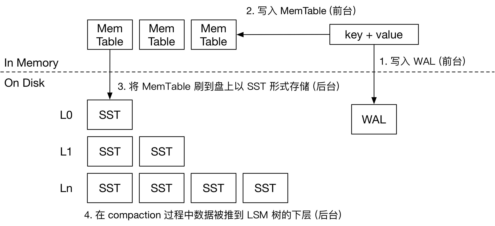

# OctopusDB
Separating Keys from Values. Distributed Database System. Support Graph Query. 

# 常见LSM的写入流程

1. 接收到用户写入请求后，首先写入`wal`和`memtable`：`wal`用做预写日志，持久化，`memtable`是kv存储的内存结构，通常使用跳表实现
2. 后台主要有两个任务：将`memtable`刷到磁盘，以及对`sst`文件做合并
   1. 内存中同一时刻只有一个活跃的`memtable`接收写入请求，其他都为`immemtable`。当内存中的`memtable`大小达到阈值之后，会转变为`sst`并刷到磁盘上
   2. `sst`就是有序存储的数据文件，`SST` 的末尾是若干个索引块，记录每个数据块开头的 key，以便快速定位 key 的位置。`SST` 中可能含有 `Bloom Filter` 等结构加速查询。
3. 第0层包含多个`SST`文件，每个文件包含的key范围可能重复，从L1层开始，同一层的文件内key不会重复，后台线程会对超出容量的`SST`文件做合并